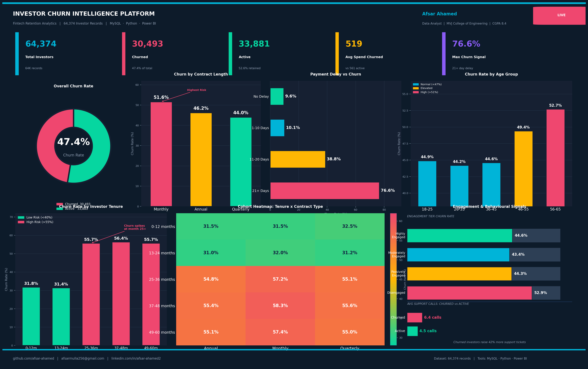

# 📦 Amazon India Sales Performance Analysis

**E-Commerce Sales Intelligence — 128,975 orders analysed**

> Tools: **MySQL · Python · Power BI · Matplotlib · Seaborn**



---

## 🔍 Project Overview

An end-to-end sales analytics project on Amazon India's fashion category orders from **Apr–Jun 2022**. This project uncovers revenue trends, top-performing categories and states, cancellation patterns, and fulfilment efficiency.

---

## 📁 Project Structure

```
amazon-sales-analysis/
├── amazon_sales_analysis.sql       # 10 MySQL queries — schema to window functions
├── visualisations.py               # 4 Python charts
├── amazon_sales_powerbi.csv        # Enriched dataset for Power BI
├── dashboard.png                   # Professional dashboard image
├── charts/                         # Individual chart PNGs
└── README.md
```

---

## 📊 Dataset

| Field | Description |
|---|---|
| Order ID | Unique order identifier |
| Date | Order date (Apr–Jun 2022) |
| Status | Shipped / Delivered / Cancelled / Returned |
| Category | Set / Kurta / Western Dress / Top / etc. |
| Size | XS / S / M / L / XL / XXL / 3XL |
| Qty | Units ordered |
| Amount | Revenue in INR |
| ship-state | Delivery state |
| Fulfilment | Amazon or Merchant fulfilled |
| B2B | Business order flag |

**Records:** 128,975 | **Period:** Apr–Jun 2022 | **Total Revenue:** ₹78.6 Cr

---

## 🔑 Key Findings

| Finding | Insight |
|---|---|
| **Set category dominates** | ₹39.2M revenue — 49.9% of total |
| **Maharashtra is #1 market** | ₹13.3M revenue, ahead of Karnataka (₹10.5M) |
| **14.2% cancellation rate** | 18,332 orders cancelled — revenue leakage |
| **Amazon fulfils 69.6%** | Higher delivery rate than Merchant channel |
| **M & L are top sizes** | 22,711 and 22,132 units — peak demand sizes |
| **Revenue declining MoM** | -9.1% Apr→May, -10.7% May→Jun — seasonal trend |

---

## 🛠️ SQL Query Sections

1. Executive Summary KPIs
2. Monthly Revenue Trend (with LAG window function)
3. Category Performance with revenue share %
4. Order Status Breakdown
5. Top 10 States by Revenue (RANK window function)
6. Fulfilment Channel Analysis (Amazon vs Merchant)
7. Size-Wise Demand Analysis
8. B2B vs B2C Comparison
9. Cumulative Revenue Share (CTE + window function)
10. Cancellation Deep-Dive by Category & State

---

## 👤 Author

**Afsar Ahamed** | Data Analyst | ECE, MVJ College of Engineering | CGPA 8.4
📧 afsarmulla256@gmail.com | 🔗 linkedin.com/in/afsar-ahamed2
